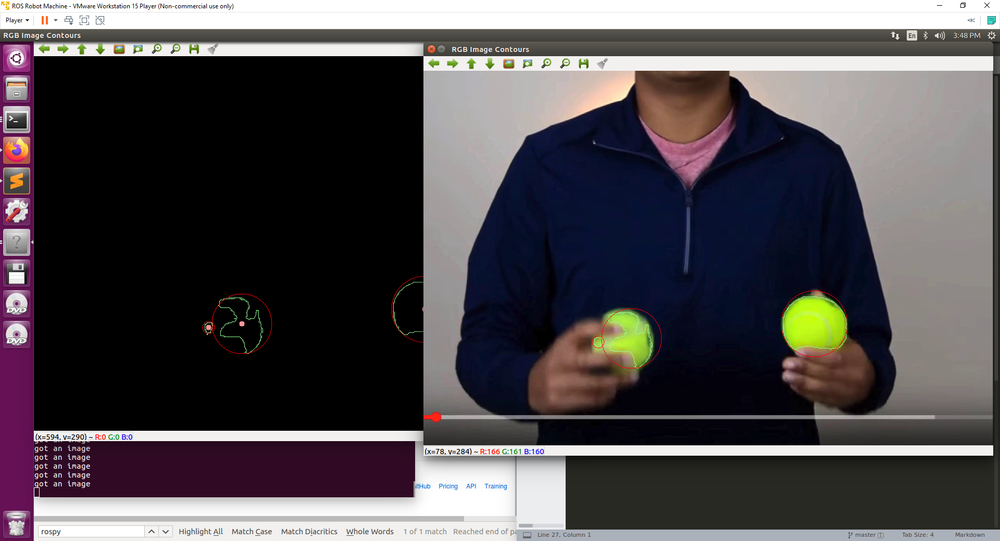

# OpenCV Projects for ROS

OpenCV Projects for ROS is a package that has python scripts that can be run on the ROS ecosystem to track tennis balls from either video or USB camera streams. 

## Installation
### Requirements
Ubuntu 16.04  
[ROS Kinetic Kame](http://wiki.ros.org/kinetic/Installation)  
Python 2.7.12  
[OpenCV](https://docs.opencv.org/3.4/d2/de6/tutorial_py_setup_in_ubuntu.html)

## Background
These programs were done as projects for the Udemy course [ROS for Beginners: Basics, Motion, and OpenCV](https://www.udemy.com/course/ros-essentials/) by Professor Anis Koubaa.  

These OpenCV programs are used as an example of how to use OpenCV with ROS's publish and subscribe messaging system. 

## Usage
1. Clone this repository into your catkin workspace, then follow the remaining steps:
```
$ cd ~/catkin_ws
$ catkin_make
$ roscore
```
In another terminal run the following:
```
$ rosrun opencv_ros_projects ./tennis_ball_listener.py
```
In a third terminal run the following:
```
$ rosrun opencv_ros_projects ./tennis_ball_publisher.py
```
Your screen should look like this:  


